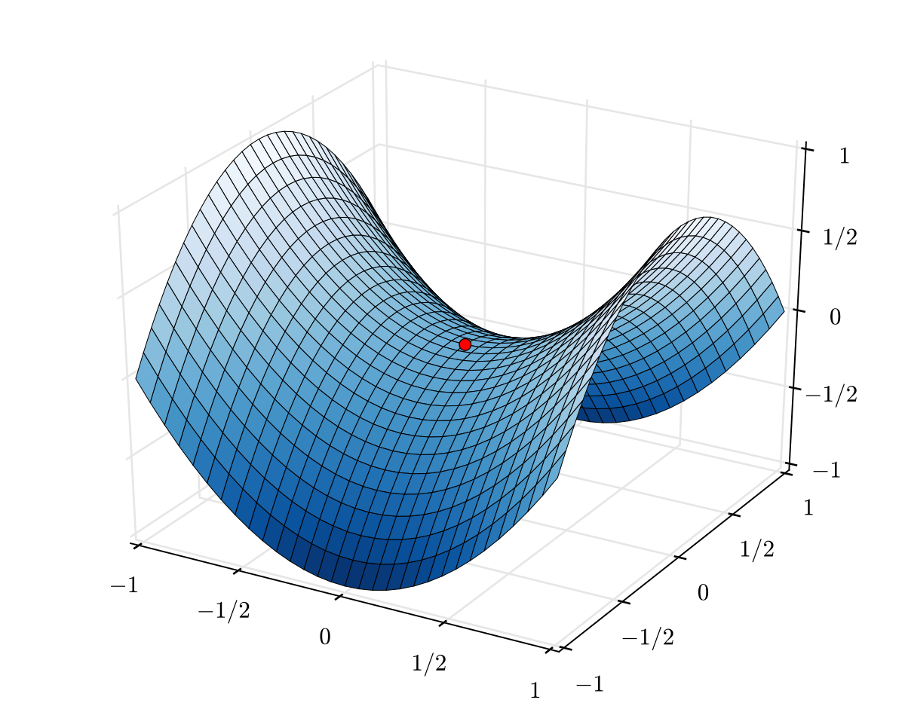
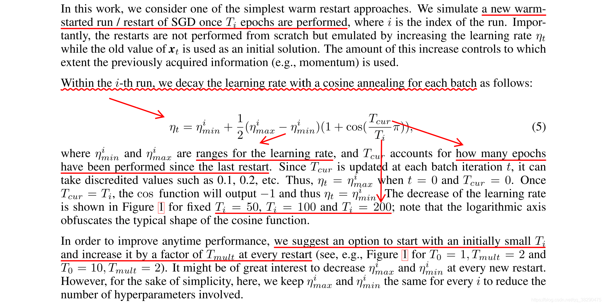

# 深度学习模型训练trick

### Focal loss

**背景**：Focal loss本来是为了解决在one-step目标检测过程中，正样本和负样本极度不平衡导致模型无法正常训练的问题。正负样本比例小于1:1000。

**原理**：focal loss平衡易判断的样本和判断困难的样本之间的权重,将模型预测的很准的样本损失减小。计算公式：

$$ FL(p_t) = (1−p_t)^{\gamma}log(p_t)\quad  p_t=\begin{cases} p,y_t = 1\\ 1-p,y_t = 0 \end{cases}$$

当模型判断错误时，$p_t$接近0，$1-p_t$接近1，权重也接近1，对损失没有影响；判断正确时,$1-p_t$接近0，权重接近0，降低了正确分类样本的损失。由于目标检测中大多数负样本都非常容易判断（图片中不包含任务物体的区域很多），因此降低简单样本的权重后可以解决正负样本极度不平衡的问题。

__实现代码__

```python
import tensorflow.keras.backend as K
import tensorflow as tf

def binary_focal_loss(gamma=2, alpha=0.25):
    """
    Binary form of focal loss.
    适用于二分类问题的focal loss
    
    focal_loss(p_t) = -alpha_t * (1 - p_t)**gamma * log(p_t)
        where p = sigmoid(x), p_t = p or 1 - p depending on if the label is 1 or 0, respectively.
    References:
        https://arxiv.org/pdf/1708.02002.pdf
    Usage:
     model.compile(loss=[binary_focal_loss(alpha=.25, gamma=2)], metrics=["accuracy"], optimizer=adam)
    """
    alpha = tf.constant(alpha, dtype=tf.float32)
    gamma = tf.constant(gamma, dtype=tf.float32)

    def binary_focal_loss_fixed(y_true, y_pred):
        """
        y_true shape need be (None,1)
        y_pred need be compute after sigmoid
        """
        y_true = tf.cast(y_true, tf.float32)
        alpha_t = y_true*(1-alpha) + (K.ones_like(y_true)-y_true)*alpha
    
        p_t = y_true*y_pred + (K.ones_like(y_true)-y_true)*(K.ones_like(y_true)-y_pred) + K.epsilon()
        focal_loss = - alpha_t * K.pow((K.ones_like(y_true)-p_t),gamma) * K.log(p_t)
        return K.mean(focal_loss)
    return binary_focal_loss_fixed
```

根据论文中提到的，正负样本权重平衡的功能后模型效果更好。这里面加上了alpha参数，代表正负样本的权重，正样本权重为1-alpha，负样本权重为alpha。

__效果分析__

Focal Loss会大幅降低简单样本的损失权重，举例说明：令$\gamma = 2$，一个预测正确样本的$p_t = 0.9$，损失的权重为$(1-p_t)^{\gamma} = 0.01$将损失降低了100倍。这样相当于增加了预测错误的样本的损失权重，使得__模型更专注于优化预测错误的样本，而不是专注于将预测正确的样本预测的更极端__。$\gamma$的取值和loss变化的关系图如下。


__推荐场景__ 在推荐算法中，正负样本比例的差异也非常大，在我自己的数据集上使用Focal Loss会将AUC提升3%左右，而且可以替换负采样，使得模型不用负采样也能正常训练。


### 余弦退火算法


__背景__：深层神经网络难训练是因为学习过程**容易陷入到马鞍面**中，即在坡面上，一部分点是上升的，一部分点是下降的，如图在z轴上是最小值，而在x轴上是最大值。马鞍面上损失对参数的一阶导数为0，二阶导数的正负值不相同，由于梯度为0，模型无法进一步更新参数，因此模型训练容易陷入马鞍面中不再更新。



__原理__：学习率退火算法，每个batch训练后学习率减小一点，当减小到规定值后学习率马上增大到初始值，循环该过程。每次训练后学习率衰减是因为，随着模型的训练参数需要调整的量越来越少，所以需要更小的学习率；而达到模型训练一段时间后，可能陷入了马鞍面梯度非常小，因此将学习率增大到初始值，希望用一个很大的学习率让参数有较大的更新，使模型冲出马鞍面。

学习率余弦退火算法，论文中对学习率规划原理描述如下，公式表明学习率随迭代次数的变化规律。



变量名称解释如下：

1. $\eta_{min}^{i} $和$\eta_{max}^{i} $代表学习率变化的范围。
2. $T_{cur}$代表上次重启后，经过了多少个epoch。
3. $T_i$代表第i次重启，一共需要训练多少个epoch。

这样在一个周期内，学习率将会按照余弦衰减的趋势从$\eta_{max}^{i} $减小到$\eta_{min}^{i} $。然后进入下一个周期，学习率变化图像如下。


__实现代码__

```python
from keras import *
import keras
from keras import layers
import matplotlib.pyplot as plt
import numpy as np
import tensorflow as tf

import keras.backend as K

class CosineAnnealing(callbacks.Callback):
    """Cosine annealing according to DECOUPLED WEIGHT DECAY REGULARIZATION.

    # Arguments
        eta_max: float, eta_max in eq(5).
        eta_min: float, eta_min in eq(5).
        total_iteration: int, Ti in eq(5).
        iteration: int, T_cur in eq(5).
        verbose: 0 or 1.
    """

    def __init__(self, eta_max=1, eta_min=0, num_step_per_epoch = 100,lr_list = [],verbose=0, **kwargs):
        
        super(CosineAnnealing, self).__init__()

        global lr_log
        
        self.lr_list = lr_list
        lr_log = []
        self.eta_max = eta_max
        self.eta_min = eta_min
        self.verbose = verbose
        
        self.iteration = 0
        self.cur_epoch = 0
        self.num_start = 0
        self.total_epoch = lr_list[self.num_start]
        self.num_step_per_epoch = num_step_per_epoch
        self.total_iteration = self.total_epoch*num_step_per_epoch
    
    def on_train_begin(self, logs=None):
        self.lr = K.get_value(self.model.optimizer.lr)
        #防止多个epoch分开训练。
        eta_t = self.eta_min + (self.eta_max - self.eta_min) * 0.5 * (1 + np.cos(np.pi * self.iteration / self.total_iteration))
        new_lr = self.lr * eta_t
        K.set_value(self.model.optimizer.lr, new_lr)
        
    def on_train_end(self, logs=None):
        K.set_value(self.model.optimizer.lr, self.lr)
    
    def on_epoch_end(self, epoch, logs=None):
        self.cur_epoch += 1
        if self.cur_epoch == self.total_epoch:
            self.cur_epoch = 0
            self.num_start += 1
            self.total_epoch = self.lr_list[min(self.num_start,len(self.lr_list)-1)]
            
            self.iteration = 0
            self.total_iteration = self.total_epoch*self.num_step_per_epoch

    def on_batch_end(self, epoch, logs=None):
        self.iteration += 1
        logs = logs or {}
        logs['lr'] = K.get_value(self.model.optimizer.lr)
        
        eta_t = self.eta_min + (self.eta_max - self.eta_min) * 0.5 * (1 + np.cos(np.pi * self.iteration / self.total_iteration))
        new_lr = self.lr * eta_t
        K.set_value(self.model.optimizer.lr, new_lr)
        if self.verbose > 0:
            print('\nEpoch %05d: CosineAnnealing '
                  'learning rate to %s.' % (epoch + 1, new_lr))
        lr_log.append(logs['lr'])

if __name__ == '__main__':
    # 准备数据集
    num_train, num_test = 2000, 100
    num_features = 200
    
    true_w, true_b = np.ones((num_features, 1)) * 0.01, 0.05
    
    features = np.random.normal(0, 1, (num_train + num_test, num_features))
    noises = np.random.normal(0, 1, (num_train + num_test, 1)) * 0.01
    labels = np.dot(features, true_w) + true_b + noises
    
    train_data, test_data = features[:num_train, :], features[num_train:, :]
    train_labels, test_labels = labels[:num_train], labels[num_train:]
    
    # 选择模型
    model = keras.models.Sequential([
        layers.Dense(units=128, activation='relu', input_dim=200), 
        layers.Dense(128, activation='relu', kernel_regularizer=keras.regularizers.l2(0.00)),
        layers.Dense(1)
    ])
    
    model.summary()
    model.compile(optimizer='adam',loss='mse',metrics=['mse'])
    #需要传入参数，max，min。lr会在max和min之间衰减，乘上原来的lr。
    #num_step_per_epoch每个epoch会训练多少次。
    #lr_list每次的重启周期，例如这里2个epoch是一个周期，4个epoch一个周期，8，15，32.等。
    
    lr_list = [2,4,8,16,32]
    reduce_lr = CosineAnnealing(eta_max=1, eta_min=0, num_step_per_epoch=(2000 // 16), lr_list = lr_list)
    # for e in range(62):
        # model.fit(train_data, train_labels, batch_size=16, epochs=1, validation_data=(test_data, test_labels), callbacks=[reduce_lr])
    model.fit(train_data, train_labels, batch_size=16, epochs=62, validation_data=(test_data, test_labels), callbacks=[reduce_lr])
    plt.plot(lr_log)
```

keras中通过回调函数来动态改变模型的学习率。初始化参数：

1. eta_max学习率最大时等于$lr\cdot eta\_max$，同理eta_min学习率最小时等于$lr \cdot eta\_min$，一般取1和0.
2. num_step_per_epoch代表，每个epoch要训练多少个batch。
3. lr_list：代表每个重启周期的epoch轮数，例如[2,4]代表2个epoch是一个周期，4个epoch一个周期。

